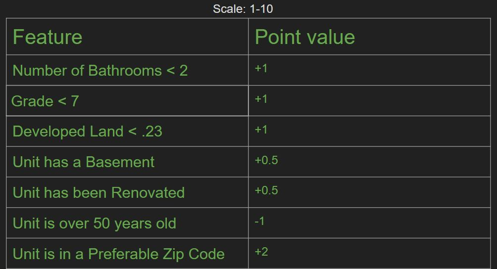
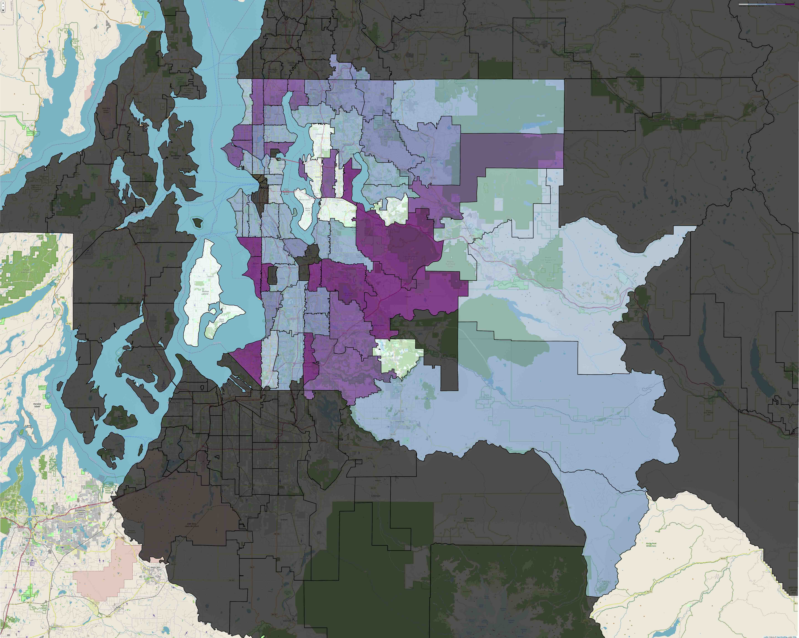

# Overview 

We started our project by determining a valid stakeholder and deciding what are the values they are looking for, how do those show up in our data and which one could be strongly correlated to our target: price. We were able to find strong correlations between things like bathrooms, grades and square feet of living space. These were some of the key initials features we decided to use in our model. After several iterations of the model we had a good idea of what would generate a high score and were able to look beyond that to create our own scale based on our parameter estimates. The parameter estimates are listed below:
 
Low number of bathrooms 
Available lot space for expansions  
Finishing unfinished basements 
High lot value but low building value for potential teardown  
Lower square footage compared to neighbors to stay competitive 
 
This allowed us to come up with our own value scale to model what we believed would make the ideal house to flip, something that would appeal to our stakeholders. Using these tools and our folium maps you can see in our slides we generated three sample properties as part of our business proposition.

# Business Understanding 

Our main goal is to be able to provide tools to our partners in HGTV and Discovery that allow them to evaluate houses in King County. We would like to propose to them that they choose Seattle as their next house flipping destination for a show like Property Brothers. Seattle is uniquely suited for this because it has been growing at an extremely high rate over the last few years due to the tech boom. This brings in lots of wealthy buyers, people looking to buy properties and settle here. Luckily Seattle also has a very old history providing many houses that were built just after the turn of the century that need to be updated, renovated and would be ideal for house flipping. We think with the tools provided, our parameter estimates, our folium map, and linear regression model you will be easily able to find the kinds of properties needed. 

# The Data

Our data is sourced from the King County Department of Assessment, which covers the Greater Seattle area. As a local government organization the data collected and distributed by the department is as trustworthy as data can be. Seattle GeoData is our second source, which provided the necessary locale information to create our visualizations

Property grading scale based on inferred features

Flipping oppurtunity by zipcode, using the grading scale above

# Next Steps

Improve the value scale from a binary grading system to a continuous one. 
Fix folium resizing map markers if folium regains that functionality. 
Find additional data relating to nearby amenities. 
Find recent data to add the element of time. 
Find more precise data, such as if basements are finished or not. 

# For More Information

Please refer to the complete notebook for a full analysis of the data and interactive maps, or our presentation for a quicker overview.
 
# Repository Structure

├── data 
....├── column_names.MD 
....├── feature_scale.jpg 
....├── kc_house_data.csv 
....├── Chloropleth.jpg
....└── SeattleWashington13738.jpg 
├── team notebooks 
....├── Christos Messy Notebook.ipynb 
....├── Christos_eda_project_2.ipynb 
....├── marcos_eda_project_2.ipynb 
....├── Phase 2 project Rachel.ipynb 
....└── student.ipynb 
├── Final_notebook.ipynb 
├── CONTRIBUTING.md 
├── halfway_there.gif 
├── LICENSE.md 
└── README.md 